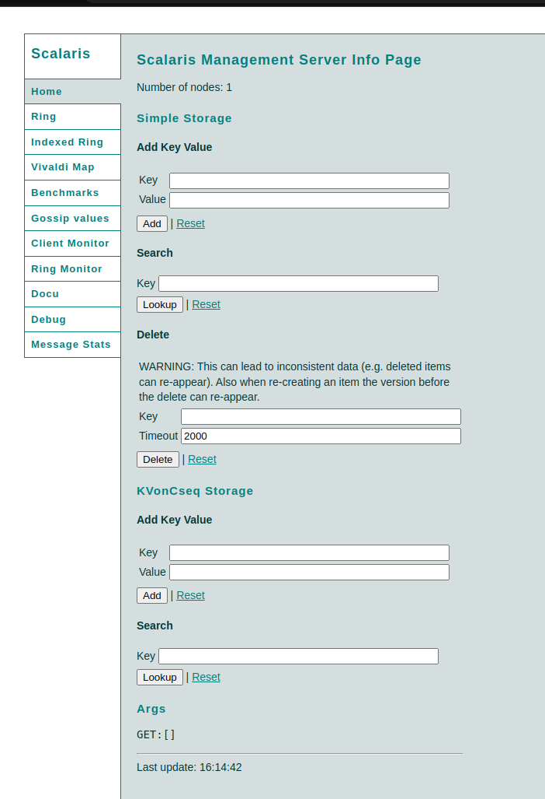
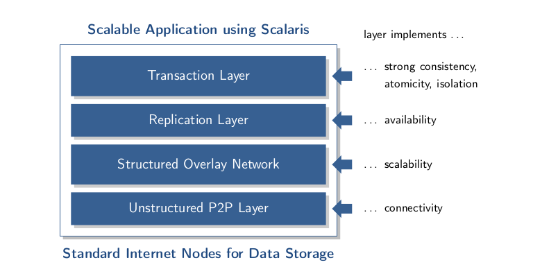
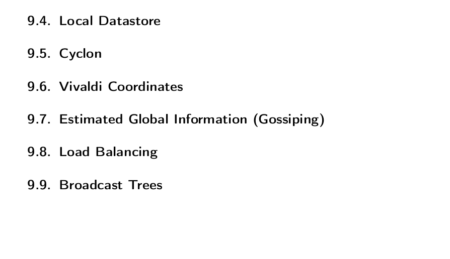

# Scalaris DB

## Cправка

### История

Разработка Scalaris Database была начата в 2007 году в [Институтe Цузе в Берлине](https://www.zib.de/) как экспериментальный проект базы данных ключ-значение на основе распределенной хеш-таблицы. В этой Cубд разработчики реализовали много сторонних и собственных новых на то время алгоритмических решений и наработок [[1.2](https://github.com/scalaris-team/scalaris/blob/master/user-dev-guide/main.pdf)], что позволило создать первую NoSQL субд, поддерживающую ACID. В 2010 году проект стал опенсурсным нна GitHub. Единственное сообщество что развивало эту бд это был интститут, и с тех пор много было много доработок и улучшений но версию 1.0 так и не смогли добить :( остановились на 0.9.0, которую выпустили в 2016 году. ~~После 2016 года кажется проект умер,~как жаль что обычным людям довольно сложно понять исходники на ерланге.~~

В целом уклон этой базы данных был больше на эксперимент, чем на коммерческий продукт, поэтому далее я расскажу про особенные фичи которые я смог вычитать и опробовать из ~~очень подробной~~ документации и копания в исходниках.

### Технический обзор

Scalaris это key-value хранилище, оно написано командой [разработчиков](https://github.com/scalaris-team/scalaris/blob/master/AUTHORS) из Берлина на языке [Erlang](https://ru.wikipedia.org/wiki/Erlang), который специально заточен под разработку распределенных систем c использованием многопоточности и прочих крутых штук. Документацию по бд можно найти на [оф. сайте](https://scalaris.zib.de/) и [гитхабе](https://github.com/scalaris-team/scalaris). Для взаимодействия с Scalaris можно использовать API на Erlang, Java, Python, Ruby, PHP, Perl или C++.

А также GUI в браузере.



## Особенности архитектуры

### Устройство

Scalaris является NoSql субд, с поддержкой CP из CAP теоремы. Разработчики выбрали осознанный отказ от доступности, так как это должно было существенно помочь разработчикам веб-сервисов [[1.1](https://github.com/scalaris-team/scalaris/blob/master/user-dev-guide/main.pdf)].

Scalaris состоит из 4 слоев каждый из которых поддерживает определенные функции



[DHT](https://en.wikipedia.org/wiki/Distributed_hash_table) Используется для хранения и поиска данных, что позволяет автоматически распределять файлы БД по разным носителям. Субд организует реплики в топологию кольца и использует [Метрику Вивальди](https://en.wikipedia.org/wiki/Vivaldi_coordinates) для оптимизации производительности.
Об этом можно почтитать по ссылкам, к сожалению официальная документация на этом ой все...



### Запросы

Scalaris поддерживает только базовые операции put, find, delete (с большой оговоркой так как удаление может привести к несогласованности данных на некоторое время и изначально этой опреации вообще не было ~~втф~~). Как таковых планов запросов у бд нет и индексов тоже, тк архитектура на хеш-таблице.

Когда мы хотим сделать запрос в субд, то мы делаем запрос (который конвертируется в http) с помощью апи на любую из нод и нода с помощью специальных маршрутных таблиц прокидывает запрос на соседей, которые возвращают результат на исходную ноду [[9.3](https://github.com/scalaris-team/scalaris/blob/master/user-dev-guide/main.pdf)]

### Транзакции

Scalaris поддерживает транзакции и ACID наряду с SQL решениями с помощью механизма Paxos Commit, который хорошо описан [тут](https://lamport.azurewebsites.net/video/consensus-on-transaction-commit.pdf), но как он имплементирован в Scalaris история, увы, умалчивает.


## Практика

### Запуск

Для поднятия субд с несколькими рекликами сначала соберем проект с гитхаба как в документации [[2.1-2.3](https://github.com/scalaris-team/scalaris/blob/master/user-dev-guide/main.pdf)] и запустим следующие команды:

```Shell
$ gnome-terminal -- .scalaris/bin/firstnode.sh
$ gnome-terminal -- .scalaris/bin/joining_node.sh 2
$ gnome-terminal -- .scalaris/bin/joining_node.sh 3
$ gnome-terminal -- .scalaris/bin/joining_node.sh 4
$
```

Это запустит СУБД с 4 нодами, далее можно обращаться на [localhost:8000](http://localhost:8000) для доступа к субд.

### Запросы к СУБД

Как и сказано раньше запросы можно делать из браузера, или одного из предоставленного API (я выбрал python CLI [[4.2.2](https://github.com/scalaris-team/scalaris/blob/master/user-dev-guide/main.pdf)]).

Положим пару строк в субд:

```Shell
$ python2 scalaris/python-api/scalaris_client.py -w hello world
$ write(hello, world): ok
$ python2 scalaris/python-api/scalaris_client.py -w scalaris database
$ write(hello, world): ok
$
```

Найдем строку с hello в субд:

```Shell
$ python2 scalaris/python-api/scalaris_client.py -r hello
$ read(hello) = u'world'
$
```

Найдем несуществующую с world в субд:

```sh
$ python2 scalaris/python-api/scalaris_client.py -r world
$ read(world) failed with not_found
$
```

### Завершение работы

Чтобы посмотреть все запущенные реплики можно использовать команду:

```sh
$ ./scalaris/bin/scalarisctl list
$
```

Далее убиваем все созданные ноды:

```sh
$ ./scalarisctl -n node3@127.0.0.1 stop
$ ./scalarisctl -n node2@127.0.0.1 stop
$ ./scalarisctl -n node1@127.0.0.1 stop
$ ./scalarisctl -n firstnode@127.0.0.1 stop
$
```

## Заключение

Как итог по моему мнению субд Scalaris может быть только интересна с учебной стороны и применять ее на бою особо не смысла, тк документация не полна и работа над базой прекратилась. Хотя написано апи для довольно понятно и для многих языков, как говорится есть потенциал.

Про апдейты (точнее их наверное уже историю так как все загнулось) можно прочитать [тут](http://scalaris.zib.de/releases.html).


