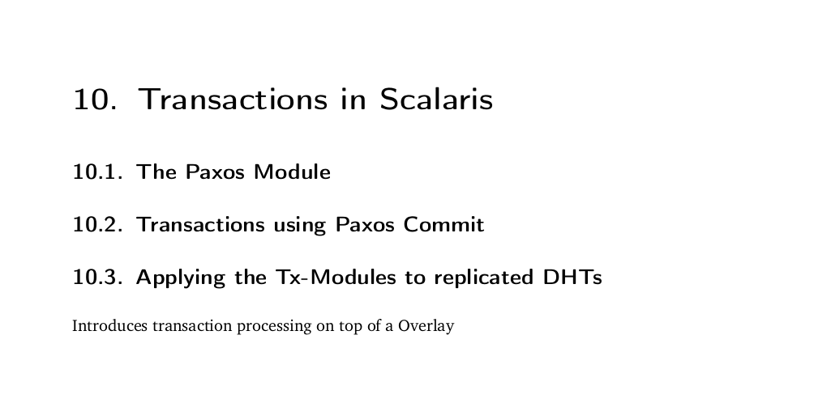

# Scalaris DB

## Cправка

### История

Разработка Scalaris Database была начата в 2007 году в [Институтe Цузе в Берлине](https://www.zib.de/) как экспериментальный проект базы данных ключ-значение на основе распределенной хеш-таблицы при поддержки различных европейских компаний. В этой базе данных разработчики реализовали много сторонних и собственных новых на то время алгоритмических решений и наработок ([[1.2](https://github.com/scalaris-team/scalaris/blob/master/user-dev-guide/main.pdf)] их там кажется больше 50!), что позволило создать первую NoSQL субд, поддерживающую ACID. В 2010 году проект стал открытым на GitHub. С тех пор много было много доработок и улучшений но версию 1.0 так и не смогли добить :( остановившись на 0.9.0, выпущенной в 2016 году. ~~После 2016 года кажется проект умер~~. Так как проект опенсурсный каждый может вложить что-то свое, но в итоге единственное сообщество что развивало эту бд это Институт В Цузе. ~~Жаль что обычным людям довольно сложно понять исходники на ерланге.~~

В целом уклон этой базы данных был больше на эксперимент, чем на коммерческий продукт, поэтому далее я расскажу про особенные фичи которые я смог вычитать и опробовать из ~~очень подробной~~ документации и копания в исходниках.

### Техническая обзор

Scalaris это key-value хранилище, оно написано командой [разработчиков](https://github.com/scalaris-team/scalaris/blob/master/AUTHORS) из Берлина на языке [Erlang](https://ru.wikipedia.org/wiki/Erlang), который специально заточен под разработку распределенных систем c использованием многопоточности и прочими крутыми штуками. Документацию по бд можно найти на [офф. сайте](https://scalaris.zib.de/) и [гитхабе](https://github.com/scalaris-team/scalaris). Для взаимодействия с Scalaris можно использовать API на Erlang, Java, Python, Ruby, PHP, Perl или C++.

А также GUI в браузере.

## Особенности архитектуры

### Устройство

Scalaris является NoSql субд, с поддержкой CP из CAP теоремы. Разработчики выбрали осознанный отказ от доступности, так как это должно было существенно помочь разработчикам веб-сервисов [[1.1](https://github.com/scalaris-team/scalaris/blob/master/user-dev-guide/main.pdf)].

Scalaris использует [DHT](https://en.wikipedia.org/wiki/Distributed_hash_table) для хранения и поиска данных, что позволяет автоматически распределять файлы БД по разным носителям. Субд организует реплики в топологию кольца и использует [Метрику Вивальди](https://en.wikipedia.org/wiki/Vivaldi_coordinates) для оптимизации производительности.
Об этом можно почтитать по ссылкам, к сожалению официальная документация ой все...

### Запросы

Scalaris поддерживает только базовые операции put, find, delete (с большой оговоркой так как удаление может привести к несогласованности данных на некоторое время и изначально этой опреации вообще не было ~~втф~~). Как таковых планов запросов у бд нет и индексов тоже, тк архитектура на хеш-таблице.

Когда мы хотим сделать запрос в субд, то мы можем можем сделать http-запрос на любую из нод и с помощью специальных маршрутных таблиц на каждой ноде прокинет запрос на соседей и вернет на исходную ноду результат [[9.3](https://github.com/scalaris-team/scalaris/blob/master/user-dev-guide/main.pdf)]

### Транзакции

Scalaris поддерживает транзакции и ACID наряду с SQL решениями с помощью механизма Paxos Commit, который хорошо описан [тут](https://lamport.azurewebsites.net/video/consensus-on-transaction-commit.pdf), но как он имплементирован [[10.1](https://github.com/scalaris-team/scalaris/blob/master/user-dev-guide/main.pdf)] в Scalaris история, увы, умалчивает.

## Практика

## Заключение

Как итог по моему мнению субд Scalaris может быть только интересна с учебной стороны и применять ее на бою особо не смысла, тк документация не полна и работа над базой прекратилась. Хотя написано апи для довольно многих языков и у нее есть в теории потенциал.

Про апдейты (точнее их наверное уже историю) можно прочитать [тут](http://scalaris.zib.de/releases.html).

